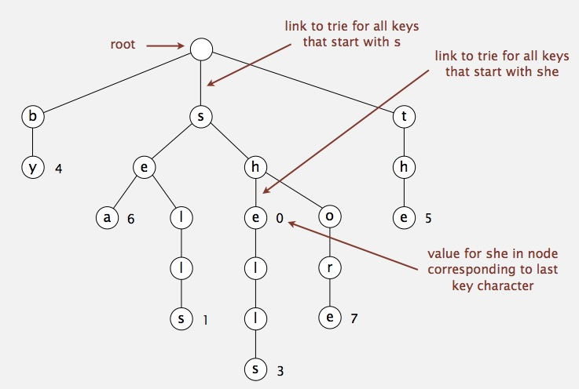
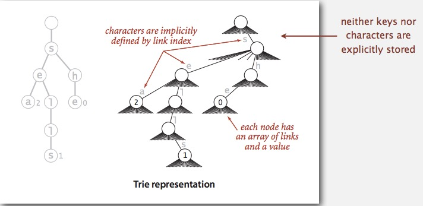
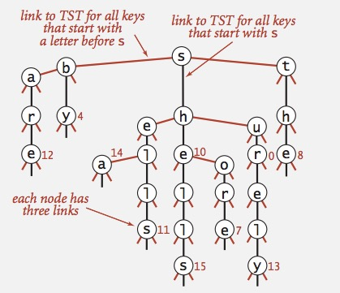

##### Week5 Tries  
上一篇講到String sorting，但如果要如字典可以加入、查詢單字的功能就需要Symbol Table般的資料結構(RB Tree,Hash Table)，為了符合字串並加入新的API(如prefix matching、match key...)修改為StringST   
實作的方式有兩種  
1.R-Way Tries:  
跟前一張的MSD結構雷同，每個節點儲存R長度陣列，代表所有的字元。  
Search時逐一節點檢查R[i]是否存在，逐步遞迴，如果最末位有value存在及表示string存在。
Insert時則逐一在R[i]創建新節點，在string最末位輸入value表示string存在。  
缺點是耗費的記憶體十分龐大。   
    
浪費的記憶體    
   
2.TST(Tenary Search Tries):  
為了節省記憶體，TST採用類似BST結構，每個節點改存三個子節點(大於、等於、小於)，透過比對字元方式，逐一遞迴插入或搜尋，其running time與R-Way Tries相似，但是記憶體節省很多。  
    
